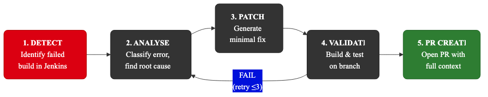
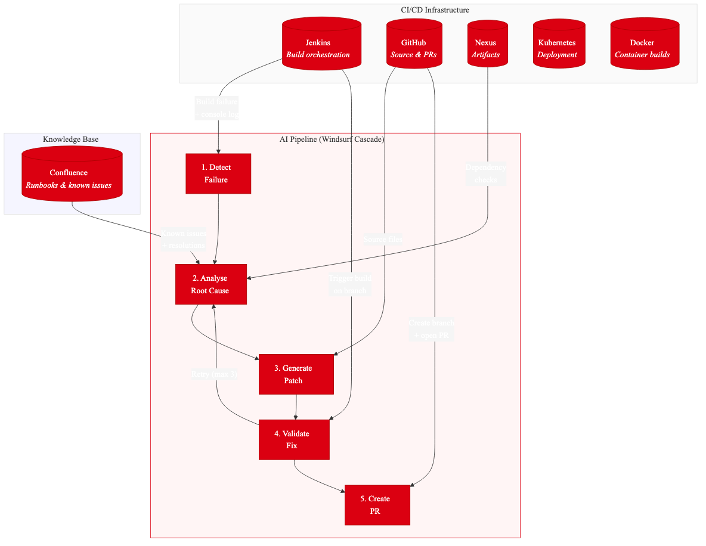
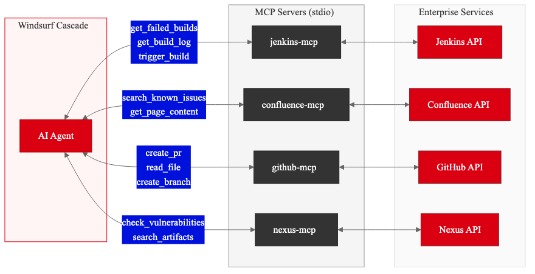
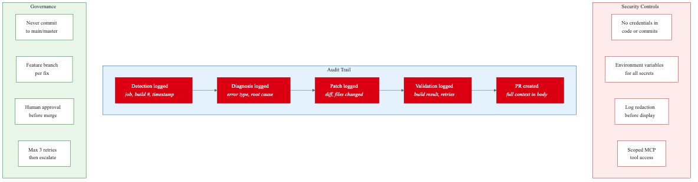

# AI-Driven DevOps Auto-Fix Pipeline

An AI-powered auto-fix pipeline that automates issue detection, resolution, and deployment in CI/CD — orchestrated through **Windsurf Cascade** with MCP (Model Context Protocol) integrations.

## Overview

This pipeline implements the HSBC AI-Driven DevOps Auto-Fix workflow from Confluence, providing two operating modes:

| Mode | Description | When to use |
|------|-------------|-------------|
| **MCP mode** | Windsurf connects directly to Jenkins, GitHub, Confluence, Nexus via MCP servers | Full automation — MCPs are configured and network-accessible |
| **Paste mode** | User pastes logs, Confluence pages, Jenkins output into Windsurf prompts | MCPs unavailable, air-gapped environments, or when human review is required at every step |

## Pipeline Stages — the core of this repo

> **Start here:** The pipeline is defined as a set of Windsurf Cascade workflows in [`.windsurf/workflows/stages/`](.windsurf/workflows/stages/). The **orchestrator** is the entry point that drives everything.

| Stage | File | Purpose |
|-------|------|---------|
| **00 — Orchestrator** | [`stages/00-orchestrator.md`](.windsurf/workflows/stages/00-orchestrator.md) | **Entry point.** Detects mode (MCP/Paste), initialises pipeline state, executes stages 01–05, manages the retry loop, breakpoints, and audit trail. |
| 01 — Detect | [`stages/01-detect.md`](.windsurf/workflows/stages/01-detect.md) | Identifies failed Jenkins builds and retrieves console logs |
| 02 — Analyse | [`stages/02-analyse.md`](.windsurf/workflows/stages/02-analyse.md) | Classifies errors, cross-references Confluence known issues, checks Nexus |
| 03 — Patch | [`stages/03-patch.md`](.windsurf/workflows/stages/03-patch.md) | Fetches source from GitHub, generates minimal unified-diff patches |
| 04 — Validate | [`stages/04-validate.md`](.windsurf/workflows/stages/04-validate.md) | Creates feature branch, triggers Jenkins build, polls for result (retries up to 3x) |
| 05 — PR Create | [`stages/05-pr-create.md`](.windsurf/workflows/stages/05-pr-create.md) | Creates GitHub PR with root cause, risk assessment, and full audit trail |

The two top-level workflows invoke the orchestrator:
- [`auto-fix-mcp.md`](.windsurf/workflows/auto-fix-mcp.md) — full automation via MCP servers
- [`auto-fix-paste.md`](.windsurf/workflows/auto-fix-paste.md) — human-in-the-loop, paste data at each step

```
DETECT → ANALYSE → PATCH → VALIDATE ─── PASS → PR CREATE
                     ↑         |
                     └── RETRY (max 3) ──┘
```



## Key Features

- **AI-Powered Build Fixes** — AI analyzes build failures and suggests fixes
- **Smart PR Generation** — Creates pull requests for human review
- **Kubernetes Deployment** — Handles containerization and deployment
- **Self-Healing** — Automatically retries with AI-generated patches (up to 3x)
- **Two modes: MCP and Paste** — full automation or guided human collaboration
- **Breakpoints & Human Approval** — configurable gates for critical/low-confidence fixes
- **Audit Trail** — every action logged with timestamp, stage, and mode

## Architecture



### Components

| Component | Purpose | MCP Server |
|-----------|---------|------------|
| Jenkins | Orchestrates the CI/CD pipeline | `jenkins-mcp` |
| Confluence | Documentation & runbooks | `confluence-mcp` |
| GitHub | Version control & PR management | `github-mcp` |
| Docker | Containerization | (via Jenkins) |
| Kubernetes | Container orchestration | (via Jenkins) |
| Nexus | Artifact repository | `nexus-mcp` |

### MCP Integration Map



When MCPs are **not connected**, the user manually provides this data by pasting into Windsurf prompts.

## Project Structure

```
devops-auto-fix-pipeline/
├── .windsurf/
│   ├── workflows/              # Windsurf Cascade workflow definitions
│   │   ├── auto-fix-mcp.md     # MCP Workflow (all MCPs)
│   │   ├── auto-fix-paste.md   # Paste Workflow (human pastes data)
│   │   └── stages/             # Pipeline stage definitions (start here!)
│   │       ├── 00-orchestrator.md  ← ENTRY POINT
│   │       ├── 01-detect.md
│   │       ├── 02-analyse.md
│   │       ├── 03-patch.md
│   │       ├── 04-validate.md
│   │       └── 05-pr-create.md
│   └── rules/
│       └── devops-pipeline.md  # Rules and conventions
│
├── mcp-servers/                # MCP server implementations
│   ├── jenkins-mcp/            # Jenkins MCP server
│   ├── confluence-mcp/         # Confluence MCP server
│   ├── github-mcp/             # GitHub MCP (uses existing)
│   └── nexus-mcp/              # Nexus MCP server
│
├── workflows/                  # Reusable workflow templates
│   ├── pipeline.yaml           # Master pipeline definition
│   └── prompts/                # Prompt templates for each stage
│
├── scripts/                    # Helper scripts
│   ├── setup-mcp.sh            # MCP server setup script
│   └── validate-fix.sh         # Local validation script
│
├── examples/                   # Example inputs/outputs
│   ├── jenkins-build-log.txt
│   ├── sample-patch.diff
│   └── sample-pr-body.md
│
├── docs/
│   ├── MCP-INTEGRATION.md      # Detailed MCP breakout
│   └── PASTE-MODE.md          # How to use without MCPs
│
├── mcp-config.json             # Windsurf MCP config (copy to ~/.codeium/windsurf/)
├── AGENTS.md                   # AI agent instructions (auto-discovered by Windsurf & Devin)
└── README.md
```

## Quick Start

### Mode 1: MCP mode

1. Copy MCP config:
   ```bash
   cp mcp-config.json ~/.codeium/windsurf/mcp_config.json
   ```
2. Set environment variables (Jenkins URL, tokens, etc.)
3. Open Windsurf and invoke the workflow:
   ```
   @workflow auto-fix-mcp
   ```

### Mode 2: Paste mode

1. Open Windsurf (no MCP config needed)
2. Invoke the Paste workflow:
   ```
   @workflow auto-fix-paste
   ```
3. Paste your Jenkins build log when prompted
4. Review AI analysis and proposed fix
5. Paste into your PR tool or let Windsurf create a local patch

## Security & Compliance



- All AI-generated changes are logged
- PRs require human approval before merge
- Audit trail maintained through Jenkins + GitHub
- No credentials stored in workflow files — uses environment variables

## Windsurf Configuration

This repo uses three Windsurf Cascade extension points — see [docs.windsurf.com](https://docs.windsurf.com/windsurf/cascade) for full reference:

| Mechanism | Location | Purpose |
|-----------|----------|---------|
| **AGENTS.md** | [`AGENTS.md`](AGENTS.md) (root) | Always-on project instructions — build commands, conventions, MCP server table. Auto-discovered by Windsurf and Devin. |
| **Rules** | [`.windsurf/rules/devops-pipeline.md`](.windsurf/rules/devops-pipeline.md) | Persistent governance rules — branching policy, validation requirements, retry limits, security, audit logging, output standards. |
| **Workflows** | [`.windsurf/workflows/`](.windsurf/workflows/) | The pipeline itself — invoke with `/auto-fix-mcp` or `/auto-fix-paste`. Stage files in `stages/` are referenced by the orchestrator. |

## License

Internal use only — HSBC Enterprise.
