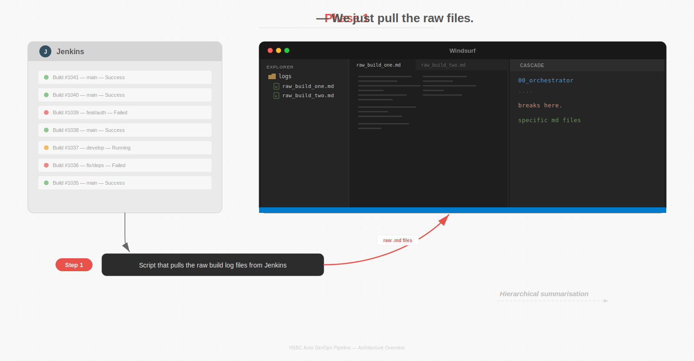
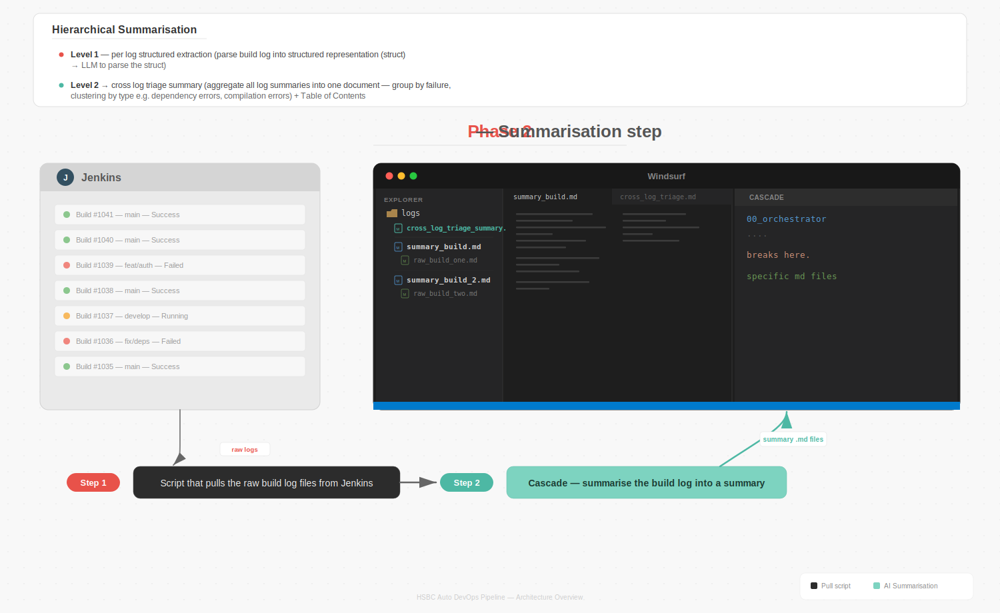

# AI-Driven DevOps Auto-Fix Pipeline

An AI-powered auto-fix pipeline that automates issue detection, resolution, and deployment in CI/CD — orchestrated through **Windsurf Cascade** with MCP (Model Context Protocol) integrations.

## Overview

This pipeline implements the HSBC AI-Driven DevOps Auto-Fix workflow from Confluence, providing two operating modes:

| Mode | Description | When to use |
|------|-------------|-------------|
| **MCP mode** | Windsurf connects directly to Jenkins, GitHub, Confluence, Nexus via MCP servers | Full automation — MCPs are configured and network-accessible |
| **Paste mode** | User pastes logs, Confluence pages, Jenkins output into Windsurf prompts | MCPs unavailable, air-gapped environments, or when human review is required at every step |

## Pipeline Stages — the core of this repo

> **Start here:** The pipeline is defined as a set of Windsurf Cascade workflows in [`.windsurf/workflows/stages/`](.windsurf/workflows/stages/). The **orchestrator** is the entry point that drives everything.

The orchestrator supports two pipeline types:

| Pipeline Type | Invoked via | Purpose |
|--------------|-------------|---------|
| **Auto-Fix** | `auto-fix-mcp` / `auto-fix-paste` | Full fix pipeline: detect → analyse → patch → validate → PR |
| **Build Log Triage** | `build-log-triage` | Read-only: ingest logs → summarise → present triage |

### Auto-Fix Stages

| Stage | File | Purpose |
|-------|------|---------|
| **00 — Orchestrator** | [`stages/00-orchestrator.md`](.windsurf/workflows/stages/00-orchestrator.md) | **Entry point.** Detects mode (MCP/Paste) and pipeline type, initialises state, routes to the appropriate flow. |
| 01 — Detect | [`stages/01-detect.md`](.windsurf/workflows/stages/01-detect.md) | Identifies failed Jenkins builds and retrieves console logs |
| 02 — Analyse | [`stages/02-analyse.md`](.windsurf/workflows/stages/02-analyse.md) | Classifies errors, cross-references Confluence known issues, checks Nexus |
| 03 — Patch | [`stages/03-patch.md`](.windsurf/workflows/stages/03-patch.md) | Fetches source from GitHub, generates minimal unified-diff patches |
| 04 — Validate | [`stages/04-validate.md`](.windsurf/workflows/stages/04-validate.md) | Creates feature branch, triggers Jenkins build, polls for result (retries up to 3x) |
| 05 — PR Create | [`stages/05-pr-create.md`](.windsurf/workflows/stages/05-pr-create.md) | Creates GitHub PR with root cause, risk assessment, and full audit trail |

### Build Log Triage Stages

| Stage | File | Purpose |
|-------|------|---------|
| 01 — Ingest | [`stages/01-ingest.md`](.windsurf/workflows/stages/01-ingest.md) | Pulls raw build logs from Jenkins into the workspace |
| 02 — Summarise | [`stages/02-summarise.md`](.windsurf/workflows/stages/02-summarise.md) | Hierarchical summarisation: per-log extraction → cross-log triage |

### Top-level workflows

The top-level workflows invoke the orchestrator:
- [`auto-fix-mcp.md`](.windsurf/workflows/auto-fix-mcp.md) — full automation via MCP servers
- [`auto-fix-paste.md`](.windsurf/workflows/auto-fix-paste.md) — human-in-the-loop, paste data at each step
- [`build-log-triage.md`](.windsurf/workflows/build-log-triage.md) — read-only triage of build logs

```
Auto-Fix:        DETECT → ANALYSE → PATCH → VALIDATE ─── PASS → PR CREATE
                                      ↑         |
                                      └── RETRY (max 3) ──┘

Build Log Triage: INGEST → SUMMARISE → present triage
```


## Key Features

- **AI-Powered Build Fixes** — AI analyzes build failures and suggests fixes
- **Smart PR Generation** — Creates pull requests for human review
- **Kubernetes Deployment** — Handles containerization and deployment
- **Self-Healing** — Automatically retries with AI-generated patches (up to 3x)
- **Two modes: MCP and Paste** — full automation or guided human collaboration
- **Breakpoints & Human Approval** — configurable gates for critical/low-confidence fixes
- **Audit Trail** — every action logged with timestamp, stage, and mode

## Two-Layer Architecture: Stages + Prompt Templates

This pipeline is built from two complementary layers. Understanding this separation is key to working with or extending it.

| Layer | Location | What it is | Consumed by |
|-------|----------|------------|-------------|
| **Stage workflows** | [`.windsurf/workflows/stages/`](.windsurf/workflows/stages/) | Procedural instructions — "do X, then Y, check Z". Defines the orchestration logic, MCP/Paste branching, inputs/outputs, and retry flow. | Windsurf Cascade (interactive IDE) |
| **Prompt templates** | [`workflows/prompts/`](workflows/prompts/) | Structured LLM prompts with `{{VARIABLE}}` placeholders. Defines *what to ask the AI* when a stage needs reasoning. | [`pipeline.yaml`](workflows/pipeline.yaml) (programmatic engine) |
| **Pipeline YAML** | [`workflows/pipeline.yaml`](workflows/pipeline.yaml) | Machine-readable pipeline definition that wires prompt templates into stages via `prompt_template:` fields. | Programmatic pipeline engine |

### How they map together

| Stage Workflow | Prompt Template(s) | What the prompt does |
|---------------|-------------------|---------------------|
| `01-detect.md` | `classify-failure-prompt.md` | Classifies the build failure into a category |
| `02-analyse.md` | `analyse-prompt.md` | Deep root cause analysis with YAML output schema |
| `03-patch.md` | `patch-prompt.md` | Generates a minimal unified diff with risk assessment |
| `04-validate.md` | `validate-prompt.md` | Reviews the patch against the build output |
| `04-validate.md` (retry) | `validate-retry-prompt.md` | Re-analyses after a failed fix attempt |
| `05-pr-create.md` | `pr-body-template.md` | Structured PR body with audit trail |
| `05-pr-create.md` | `pr-comment-template.md` | Follow-up PR comments for retries/escalation |
| `01-ingest.md` | *(no AI prompt — data retrieval only)* | — |
| `02-summarise.md` | `summarise-per-log-prompt.md` | Extracts structured summary from each build log (Level 1) |
| `02-summarise.md` | `cross-log-triage-prompt.md` | Aggregates all summaries into a triage document (Level 2) |

Each stage workflow cross-references its corresponding prompt template(s) at the top of the file.

### Error Category Taxonomy

All files use a single canonical set of failure categories:

`compilation` | `test_failure` | `dependency` | `deployment` | `infrastructure` | `configuration` | `unknown`

## Architecture


### Components

| Component | Purpose | MCP Server |
|-----------|---------|------------|
| Jenkins | Orchestrates the CI/CD pipeline | `jenkins-mcp` |
| Confluence | Documentation & runbooks | `confluence-mcp` |
| GitHub | Version control & PR management | `github-mcp` |
| Docker | Containerization | (via Jenkins) |
| Kubernetes | Container orchestration | (via Jenkins) |
| Nexus | Artifact repository | `nexus-mcp` |

### MCP Integration Map


When MCPs are **not connected**, the user manually provides this data by pasting into Windsurf prompts.

## Build Log Pipeline — Ingestion & Summarisation

The pipeline uses a two-phase approach to get Jenkins build logs into Windsurf and make them useful to the AI:

| Phase | What happens | Output |
|-------|-------------|--------|
| **Phase 1 — Raw Pull** | Script pulls build logs from Jenkins into the workspace | `raw_build_*.md` files |
| **Phase 2 — Summarisation** | Cascade applies hierarchical summarisation (per-log extraction → cross-log triage) | `summary_build*.md` + `cross_log_triage_summary.md` |





See [docs/BUILD-LOG-PIPELINE.md](docs/BUILD-LOG-PIPELINE.md) for the full strategy breakdown (overflow files, structured log format, adaptive context budgets, lazy loading).

## Project Structure

```
devops-auto-fix-pipeline/
├── .windsurf/
│   ├── workflows/              # Windsurf Cascade workflow definitions
│   │   ├── auto-fix-mcp.md     # MCP Workflow (all MCPs)
│   │   ├── auto-fix-paste.md   # Paste Workflow (human pastes data)
│   │   ├── build-log-triage.md # Build Log Triage Workflow (read-only)
│   │   └── stages/             # Pipeline stage definitions (start here!)
│   │       ├── 00-orchestrator.md  ← ENTRY POINT
│   │       ├── 01-detect.md       # Auto-Fix: failure detection
│   │       ├── 02-analyse.md      # Auto-Fix: root cause analysis
│   │       ├── 03-patch.md        # Auto-Fix: patch generation
│   │       ├── 04-validate.md     # Auto-Fix: build validation
│   │       ├── 05-pr-create.md    # Auto-Fix: PR creation
│   │       ├── 01-ingest.md       # Triage: raw log pull
│   │       └── 02-summarise.md    # Triage: hierarchical summarisation
│   └── rules/
│       └── devops-pipeline.md  # Rules and conventions
│
├── mcp-servers/                # MCP server implementations
│   ├── jenkins-mcp/            # Jenkins MCP server
│   ├── confluence-mcp/         # Confluence MCP server
│   ├── github-mcp/             # GitHub MCP (uses existing)
│   └── nexus-mcp/              # Nexus MCP server
│
├── workflows/                  # Pipeline definition + AI prompt templates
│   ├── pipeline.yaml           # Master pipeline definition (wires stages to prompts)
│   └── prompts/                # LLM prompt templates ({{VARIABLE}} placeholders)
│       ├── classify-failure-prompt.md   → Stage 01-detect
│       ├── analyse-prompt.md            → Stage 02-analyse
│       ├── patch-prompt.md              → Stage 03-patch
│       ├── validate-prompt.md           → Stage 04-validate
│       ├── validate-retry-prompt.md     → Stage 04-validate (retry)
│       ├── pr-body-template.md          → Stage 05-pr-create
│       ├── pr-comment-template.md       → Stage 05-pr-create
│       ├── summarise-per-log-prompt.md  → Stage 02-summarise (Level 1)
│       └── cross-log-triage-prompt.md   → Stage 02-summarise (Level 2)
│
├── scripts/                    # Helper scripts
│   ├── setup-mcp.sh            # MCP server setup script
│   └── validate-fix.sh         # Local validation script
│
├── examples/                   # Example inputs/outputs
│   ├── jenkins-build-log.txt
│   ├── sample-patch.diff
│   └── sample-pr-body.md
│
├── docs/
│   ├── BUILD-LOG-PIPELINE.md   # Build log ingestion & summarisation strategy
│   ├── MCP-INTEGRATION.md      # Detailed MCP breakout
│   └── PASTE-MODE.md           # How to use without MCPs
│
├── mcp-config.json             # Windsurf MCP config (copy to ~/.codeium/windsurf/)
├── AGENTS.md                   # AI agent instructions (auto-discovered by Windsurf & Devin)
└── README.md
```

## Quick Start

### Mode 1: MCP mode

1. Copy MCP config:
   ```bash
   cp mcp-config.json ~/.codeium/windsurf/mcp_config.json
   ```
2. Set environment variables (Jenkins URL, tokens, etc.)
3. Open Windsurf and invoke the workflow:
   ```
   @workflow auto-fix-mcp
   ```

### Mode 2: Paste mode

1. Open Windsurf (no MCP config needed)
2. Invoke the Paste workflow:
   ```
   @workflow auto-fix-paste
   ```
3. Paste your Jenkins build log when prompted
4. Review AI analysis and proposed fix
5. Paste into your PR tool or let Windsurf create a local patch

### Mode 3: Build Log Triage

Use this when you want to understand what is failing across multiple builds before deciding on a fix strategy.

1. Open Windsurf (MCP or Paste mode)
2. Invoke the Triage workflow:
   ```
   @workflow build-log-triage
   ```
3. Provide the Jenkins job name(s) or paste build logs
4. Review the triage summary — failures grouped by type, ranked by severity
5. Decide which failures to auto-fix, which need manual review, which to escalate

## Security & Compliance


- All AI-generated changes are logged
- PRs require human approval before merge
- Audit trail maintained through Jenkins + GitHub
- No credentials stored in workflow files — uses environment variables

## Windsurf Configuration

This repo uses three Windsurf Cascade extension points — see [docs.windsurf.com](https://docs.windsurf.com/windsurf/cascade) for full reference:

| Mechanism | Location | Purpose |
|-----------|----------|---------|
| **AGENTS.md** | [`AGENTS.md`](AGENTS.md) (root) | Always-on project instructions — build commands, conventions, MCP server table. Auto-discovered by Windsurf and Devin. |
| **Rules** | [`.windsurf/rules/devops-pipeline.md`](.windsurf/rules/devops-pipeline.md) | Persistent governance rules — branching policy, validation requirements, retry limits, security, audit logging, output standards. |
| **Workflows** | [`.windsurf/workflows/`](.windsurf/workflows/) | The pipeline itself — invoke with `/auto-fix-mcp`, `/auto-fix-paste`, or `/build-log-triage`. Stage files in `stages/` are referenced by the orchestrator. |

## License

Internal use only — HSBC Enterprise.
